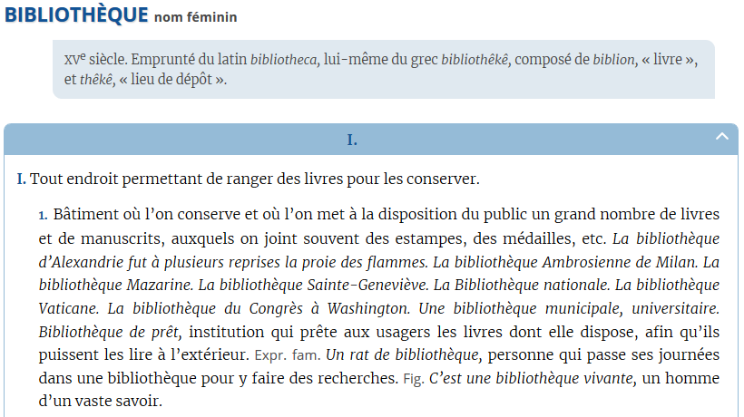
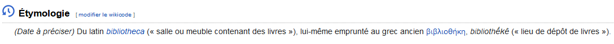

## Vous êtes ici

[Accueil](index.md)
1. **Définitions**
2. Ma deuxième classe
      1. Une sous-classe
      2. Une seconde sous-classe
      3. ...
3. Ma troisième classe
4. Ma quatrième classe
5. ...

## Définitions

Une ou deux lignes qui expliquent ce qu'on retrouve dans cette classe. Ensuite, publication des différentes ressources trouvées

### Académie Française. "Bibliothèque" [en ligne]. In *Dictionnaire de l'Académie française*. 9e édition (consulté le 1er mai 2019). En ligne : [https://www.dictionnaire-academie.fr/article/A9B0999](https://www.dictionnaire-academie.fr/article/A9B0999)
|  |
| ------------------------------------------------ |

### Wikitionnaire. "Bibliothèque" [en ligne]. In *Wikitionnaire*. Edition 24/02/2020 (consulté le 11 mai 2020). En ligne : [https://fr.wiktionary.org/wiki/biblioth%C3%A8que](https://fr.wiktionary.org/wiki/biblioth%C3%A8que)
|  |
| ------------------------------------------------------ |

### Etc.

